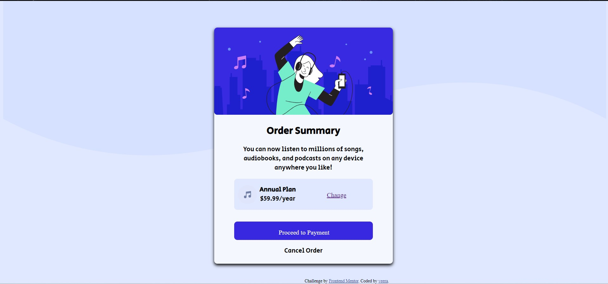

# Frontend Mentor - Order summary card solution

This is a solution to the [Order summary card challenge on Frontend Mentor](https://www.frontendmentor.io/challenges/order-summary-component-QlPmajDUj). Frontend Mentor challenges help you improve your coding skills by building realistic projects. 

## Table of contents

- [Overview](#overview)
  - [The challenge](#the-challenge)
  - [Screenshot](#screenshot)
  - [Links](#links)
- [My process](#my-process)
  - [Built with](#built-with)
  - [What I learned](#what-i-learned)
- [Author](#author)

**Note: Delete this note and update the table of contents based on what sections you keep.**

## Overview

### The challenge

Users should be able to:

- See hover states for interactive elements

### Screenshot

**Note: Delete this note and the paragraphs above when you add your screenshot. If you prefer not to add a screenshot, feel free to remove this entire section.**

### Links

- Solution URL: [Github](https://github.com/veera-0/order-summary-component)
- Live Site URL: [vercel site](https://order-summary-component-eight-sigma.vercel.app/)

## My process

### Built with

- Semantic HTML5 markup
- CSS custom properties
- Flexbox
- CSS Grid

**Note: These are just examples. Delete this note and replace the list above with your own choices**

### What I learned

By creating this order summary, I have worked with css deeply and these require more knowldege on the properties and the alignments of the components in HTML and I have struggled at first then I have adopted on how to deal with the CSS and work with them.
It's a great experience for me.

**Note: Delete this note and the content within this section and replace with your own learnings.**

**Note: Delete this note and the content within this section and replace with your own plans for continued development.**

**Note: Delete this note and replace the list above with resources that helped you during the challenge. These could come in handy for anyone viewing your solution or for yourself when you look back on this project in the future.**

## Author

- Website - [Veera Anjaneyulu](https://veera-001.netlify.app/)

**Note: Delete this note and add/remove/edit lines above based on what links you'd like to share.**

**Note: Delete this note and edit this section's content as necessary. If you completed this challenge by yourself, feel free to delete this section entirely.**
